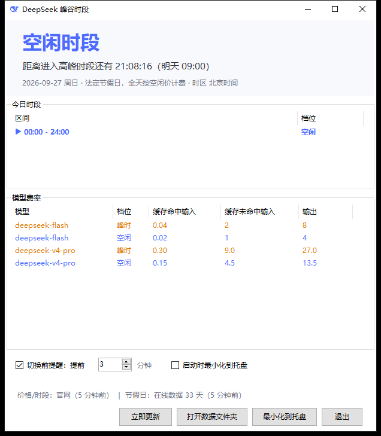

# DeepSeek 峰谷时段 · 桌面版

把 DeepSeek API 的峰谷计费时段做成常驻托盘的独立小程序：一眼看到现在贵不贵、还有多久切换。

**单个 exe，双击即用**——不需要安装 VS Code、Python 或 .NET 运行时。



## 为什么要看这个

DeepSeek 的空闲时段单价只有高峰时段的一半。跑批量任务、写代码前瞄一眼当前档位，顺手省点钱。

| 项目 | 规则 |
| --- | --- |
| 高峰时段 | 北京时间**周一至周五** 09:00-12:00、14:00-18:00（不含中国法定节假日） |
| 空闲时段 | 其余全部时间，含周末全天、法定节假日全天、调休上班的周末 |
| 价格关系 | 空闲价 = 高峰价的一半 |

程序启动时会抓取 DeepSeek 官方价格页，峰时区间与各模型单价都以官网为准，官网调价后不用手动改配置。

## 功能

- **托盘常驻**：图标本身就是状态——空闲是 DeepSeek 蓝鲸鱼，高峰变橙色；鼠标悬浮显示 `空闲 剩 21:14:00` 这样的倒计时。
- **主窗口**：当前档位大字 + 距离下次切换的倒计时 + 今日时段切分 + 各模型峰/空闲费率明细。
- **自动同步规则**：价格与峰时区间取自 DeepSeek 官方价格页；中国法定节假日取自公开数据源。周末、法定节假日全天按空闲价计。
- **切换前提醒**：默认在进入新档位前 3 分钟弹通知，提前量 1-60 分钟可调，每个切换点只提醒一次。
- **离线可用**：断网时静默回退到内置价表与节假日表，不弹窗打扰；已抓到的数据会缓存，重启立即生效。
- **单实例**：重复启动会唤起已有窗口，不会出现两个托盘图标。


左起：16px 空闲、16px 高峰、32px 空闲、32px 高峰。

## 下载

到 [Releases](../../releases/latest) 下载 `DeepSeekPeakStatus-1.0.0-win-x64.exe`，双击运行。

- 适用于 Windows 10 / 11 x64，exe 自带运行时，无需额外安装。
- 程序未做代码签名，首次运行时 SmartScreen 可能提示"已保护你的电脑"，点"更多信息 → 仍要运行"。

## 使用

| 操作 | 效果 |
| --- | --- |
| 双击托盘图标 | 显示 / 唤起主窗口 |
| 右键托盘图标 | 显示主窗口、立即从官网更新、退出 |
| 点窗口右上角 × | 收进托盘继续后台计时；退出请用托盘右键菜单的"退出" |
| 立即更新 | 忽略缓存有效期，强制重抓价格、时段与节假日 |

**放在哪里都能跑**：程序不依赖所在目录，可以把 exe 放到任意位置（例如 `D:\Tools\`），也可以发送快捷方式到桌面或开始菜单。

## 数据与隐私

程序不收集任何数据，没有遥测，不上报任何信息。它只发起两类出站请求：

1. DeepSeek 官方价格页——获取峰时区间与模型单价；
2. 公开的节假日数据源（jsDelivr 上的 holiday-cn）——获取中国法定节假日日期。

请求不携带任何身份信息。配置、缓存与错误日志放在 `%APPDATA%\DeepSeekPeakStatus\`：

| 文件 | 内容 |
| --- | --- |
| `config.json` | 界面里改的设置（提醒开关、提前量、启动时最小化等） |
| `cache.json` | 最近一次抓到的价格、峰时区间与节假日 |
| `error.log` | 仅在出错时生成 |

删掉这个目录即彻底清除全部痕迹（不会写注册表）。

## 从源码构建

需要 [.NET SDK 10](https://dotnet.microsoft.com/download) 或更高版本：

```bash
dotnet publish -c Release
```

或者在资源管理器里双击 `build.bat`。产物在 `bin\Release\net10.0-windows\win-x64\publish\` 下，是自带运行时的单文件 exe。

发布前可以做一次联网自检，它会真实跑一遍抓取、解析与时段计算并打印结果：

```bash
DeepSeekPeakStatus.exe --selftest
```

## 项目结构

| 文件 | 作用 |
| --- | --- |
| `Program.cs` | 入口：单实例互斥、未处理异常兜底、`--selftest` 分支 |
| `Peak.cs` | 峰谷计算核心：区间解析、节假日判定、今日切分、下次切换点与倒计时 |
| `Updater.cs` | 抓取并解析官方价格页（峰时区间、模型单价）与节假日 JSON |
| `Store.cs` | 配置与缓存的读写、内置兜底价表与节假日表 |
| `MainForm.cs` | 主窗口、托盘图标与菜单、切换前提醒 |
| `TrayMask.cs` | 由 `make_logo.py` 生成的鲸鱼图标掩码，运行时按档位着色 |
| `SingleInstance.cs` / `ErrorLog.cs` | 唤起已有窗口、错误日志 |
| `make_logo.py` | 从官方 `logo.svg` 生成 `app.ico` 与托盘掩码（需要 Python + Pillow + Chrome） |

## 关于图标

图标取自 DeepSeek 官方矢量 logo（`api-docs.deepseek.com/img/logo.svg`），由 `make_logo.py` 渲染出多尺寸 `app.ico` 并生成托盘用的掩码；托盘图标在此基础上按当前档位整体着色。图标版权归 DeepSeek 所有，本项目仅作标识用途。

## 致谢

功能参考 VS Code 扩展 [wangyx-tools.deepseek-peak-status](https://marketplace.visualstudio.com/items?itemName=wangyx-tools.deepseek-peak-status)（MIT）。本程序是独立的重新实现（C# / WinForms），与原扩展作者无关，也不共享代码或数据。

## 许可

[MIT](LICENSE)
